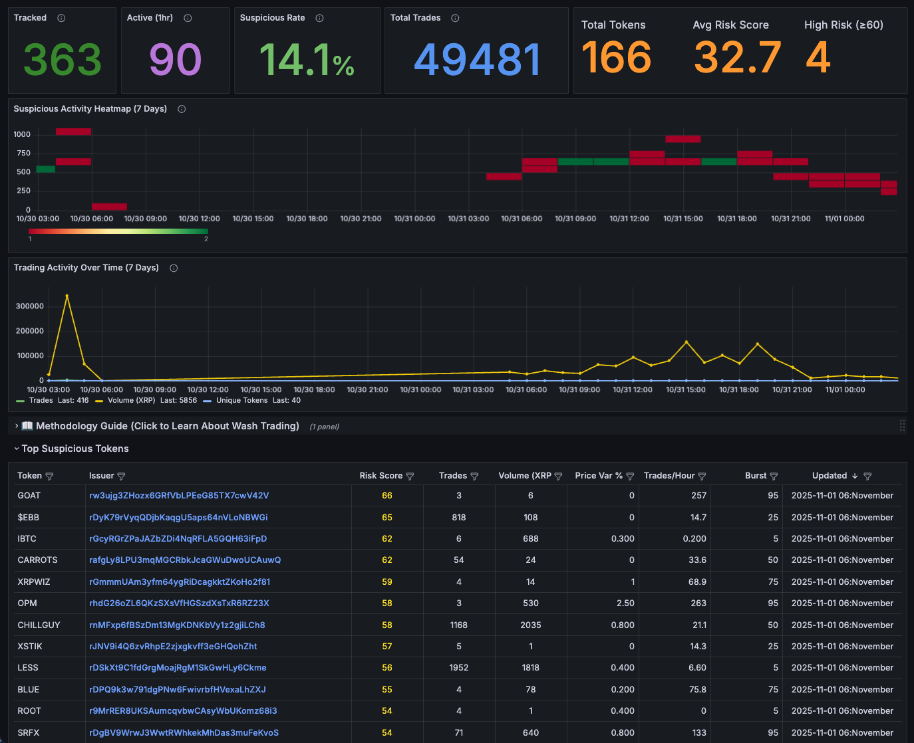

# XRP Watchdog

[](https://www.python.org/)
[](LICENSE)
[](https://xrpl.org/)

Real-time wash trading and token manipulation detection system for the XRP Ledger DEX.

## Overview

XRP Watchdog is a sophisticated monitoring system that analyzes DEX activity on the XRP Ledger to detect potential wash trading, pump-and-dump schemes, and other market manipulation tactics. The system provides a comprehensive Grafana dashboard with risk scoring, pattern analysis, and investigative tools.

### Key Features

- **Real-time Monitoring**: Collects and analyzes DEX trades every 5 minutes with 100% ledger coverage
- **Advanced Risk Scoring**: Multi-component algorithm (0-100 scale) detecting manipulation patterns
- **Burst Detection**: Identifies suspicious high-frequency trading clusters and bot activity
- **Token Whitelisting**: Excludes known legitimate tokens from risk analysis
- **Interactive Dashboard**: Beautiful Grafana interface with educational content
- **Account Tracking**: Monitors suspicious accounts trading high-risk tokens
- **Automated Analysis**: Self-healing system with comprehensive logging

## Dashboard Screenshot



The dashboard provides real-time insights into token manipulation on the XRP Ledger DEX, featuring:
- **Overview Stats**: Token counts, average risk scores, and suspicious activity rates
- **Activity Heatmap**: 7-day visualization of suspicious trading patterns
- **Trading Volume**: Time-series analysis of XRP trading activity
- **Top Suspicious Tokens**: Ranked list with risk scores, burst detection, and trade metrics
- **Interactive Methodology Guide**: Educational content explaining detection algorithms

## Quick Start

### Prerequisites

**Required before installation:**
- **Docker** - For running ClickHouse database ([Install Docker](https://docs.docker.com/get-docker/))
- **Docker Compose** - Usually included with Docker Desktop
- **Python 3.8+** - For collector and analyzer scripts
- **pip3** - Python package manager (`sudo apt install python3-pip` on Debian/Ubuntu)
- **XRP Ledger full history node** - Access via RPC (Docker container or local rippled)

**Optional (for visualization):**
- **Grafana 9.0+** - For dashboard visualization

**Note:** The `install.sh` script will check for these prerequisites and guide you through setup.

For a comprehensive list of all system dependencies, Python packages, Docker containers, and version requirements, see **[docs/DEPENDENCIES.md](docs/DEPENDENCIES.md)**.

### Installation

**Option A: Automated Installation (Recommended)**

```bash
# Clone the repository
git clone https://github.com/realgrapedrop/xrp-watchdog.git
cd xrp-watchdog

# Run interactive installer
./install.sh
```

The installer will:
- ✅ Check all prerequisites (Docker, Python, etc.)
- ✅ Detect your rippled configuration automatically
- ✅ Start ClickHouse database via Docker Compose
- ✅ Create Python virtual environment and install dependencies
- ✅ Initialize database schema
- ✅ Optionally setup cron job for auto-collection
- ✅ Optionally run initial data collection

**Option B: Manual Installation**

```bash
# Clone the repository
git clone https://github.com/realgrapedrop/xrp-watchdog.git
cd xrp-watchdog

# Start ClickHouse
cd compose
docker compose up -d
cd ..

# Create virtual environment
python3 -m venv venv
source venv/bin/activate

# Install dependencies
pip install clickhouse-connect

# Initialize database
docker exec -i xrp-watchdog-clickhouse clickhouse-client --multiquery < sql/schema.sql
```

### Configuration

1. **Configure ClickHouse connection** in collector and analyzer scripts:
   ```python
   CLICKHOUSE_HOST = "localhost"
   CLICKHOUSE_PORT = 8123
   CLICKHOUSE_DB = "xrp_watchdog"
   ```

2. **Set up cron job** for automated collection (every 5 minutes):
   ```bash
   crontab -e
   # Add:
   */5 * * * * /home/grapedrop/projects/xrp-watchdog/run_collection.sh >> /home/grapedrop/projects/xrp-watchdog/logs/auto_collection.log 2>&1
   ```

3. **Configure Grafana**:
   - Add ClickHouse data source pointing to your ClickHouse instance
   - **Option A (Quick)**: Import complete dashboard
     - Dashboards → Import → Upload JSON file
     - Select `grafana/xrp-watchdog-dashboard.json`
     - Choose your ClickHouse datasource
   - **Option B (Manual)**: Build dashboard from queries
     - Use queries from `grafana/token_stats_queries.md`
     - Create panels manually with custom layouts

### Manual Run

```bash
# Activate virtual environment
source venv/bin/activate

# Run collection (130 ledgers) with analysis
python collectors/collection_orchestrator.py 130 --analyze

# Run analyzer separately
python analyzers/token_analyzer.py
```

## Architecture

### System Components

```
┌───────────────────────────────────────────────────────────┐
│                    XRP Ledger Node                        │
│                 (Full History via RPC)                    │
└──────────────────────────┬────────────────────────────────┘
                           │
                           ▼
┌───────────────────────────────────────────────────────────┐
│              Collection Orchestrator                      │
│  ┌────────────────────────────────────────────────────┐   │
│  │  • Fetches 130 ledgers every 5 minutes             │   │
│  │  • Extracts executed trades (OfferCreate txs)      │   │
│  │  • Processes payment transactions                  │   │
│  │  • Inserts into ClickHouse                         │   │
│  └────────────────────────────────────────────────────┘   │
└──────────────────────────┬────────────────────────────────┘
                           │
                           ▼
┌───────────────────────────────────────────────────────────┐
│                  ClickHouse Database                      │
│  ┌────────────────────────────────────────────────────┐   │
│  │  Tables:                                           │   │
│  │  • executed_trades - Raw trade data                │   │
│  │  • token_stats - Aggregated risk metrics           │   │
│  │  • token_whitelist - Legitimate tokens             │   │
│  └────────────────────────────────────────────────────┘   │
└──────────────────────────┬────────────────────────────────┘
                           │
                           ▼
┌───────────────────────────────────────────────────────────┐
│                 Token Analyzer                            │
│  ┌────────────────────────────────────────────────────┐   │
│  │  • Calculates risk scores (5 components)           │   │
│  │  • Detects burst patterns                          │   │
│  │  • Applies whitelist exclusions                    │   │
│  │  • Updates token_stats table                       │   │
│  └────────────────────────────────────────────────────┘   │
└──────────────────────────┬────────────────────────────────┘
                           │
                           ▼
┌───────────────────────────────────────────────────────────┐
│                 Grafana Dashboard                         │
│  ┌────────────────────────────────────────────────────┐   │
│  │  • Risk Score Overview                             │   │
│  │  • Top Suspicious Tokens                           │   │
│  │  • Top Suspicious Accounts                         │   │
│  │  • Whitelisted Tokens                              │   │
│  │  • Methodology Guide (Educational)                 │   │
│  └────────────────────────────────────────────────────┘   │
└───────────────────────────────────────────────────────────┘
```

### Risk Scoring Algorithm

The system uses a 5-component algorithm (0-100 scale) to detect manipulation:

#### 1. Volume Component (max 60 points)
- **Formula**: `min(60, log10(volume_xrp / 1_000_000 + 1) × 15)`
- **Purpose**: Logarithmic scaling prevents extreme outliers from dominating scores
- **Scaling Examples**: 1K XRP ≈ 5pts, 10K ≈ 12pts, 100K ≈ 25pts, 1M ≈ 38pts
- **Why**: Large volumes can indicate manipulation, but linear scaling would be unfair

#### 2. Token Focus (max 30 points)
- **Metric**: Number of unique accounts trading the token
- **Scoring**:
  - ≤2 takers: 30 pts (extreme concentration)
  - 3-5 takers: 22 pts (high concentration)
  - 6-10 takers: 15 pts (moderate concentration)
  - 11-20 takers: 8 pts (low concentration)
  - 20+ takers: 3 pts (normal distribution)
- **Why**: Manipulators typically use few accounts; real tokens have many traders

#### 3. Price Stability (max 20 points)
- **Metric**: Coefficient of variation in trade prices
- **Why**: Bots trade at precise prices; real markets have natural variance
- **Threshold**: <0.5% variance = maximum suspicion

#### 4. Burst Detection (max 15 points)
- **Metric**: Trades per hour (temporal clustering)
- **Scoring**:
  - ≥100/hr: 15 pts (extreme burst)
  - ≥50/hr: 12 pts (high burst)
  - ≥20/hr: 8 pts (moderate burst)
- **Why**: Catches pump-and-dump schemes and bot-driven campaigns

#### 5. Trade Uniformity (max 10 points)
- **Metric**: Coefficient of variation in trade sizes
- **Why**: Bots trade uniform amounts; humans vary
- **Threshold**: <2% variance = robotic pattern

### Dual-Window Analysis

The v2.0 algorithm uses two time windows for comprehensive analysis:

- **24-hour window**: Pattern detection metrics (burst score, price variance, trade uniformity)
  - Captures short-term manipulation tactics
  - Identifies rapid pump-and-dump schemes
  - Detects bot-like precision in recent activity

- **7-day window**: Impact assessment (total volume, unique traders)
  - Measures sustained market impact
  - Captures longer manipulation campaigns
  - Provides context for overall token activity

This dual approach ensures both recent suspicious patterns AND their cumulative impact are considered in risk scoring.

### Data Flow

1. **Collection Phase** (every 5 minutes):
   - Fetch latest 130 ledgers from XRP Ledger node
   - Extract OfferCreate transactions with executed trades
   - Store raw trade data in `executed_trades` table
   - 280,000+ trades collected to date

2. **Analysis Phase** (after collection):
   - Aggregate trades by token (currency code + issuer)
   - Calculate statistical metrics (price variance, trade density, etc.)
   - Compute risk scores using 5-component algorithm
   - Update `token_stats` table
   - Runtime: ~40ms for 500+ tokens

3. **Visualization Phase** (continuous):
   - Grafana queries ClickHouse every 5 minutes
   - Real-time dashboard updates
   - Interactive exploration with XRPScan integration

## Dashboard

### Overview Panel
Seven key metrics displayed:
- **Tracked**: Total tokens being monitored (currently 928)
- **Active (1hr)**: Tokens with trades in last hour
- **Suspicious Rate**: Percentage of flagged accounts (currently 17.8%)
- **Total Trades**: Complete trade count (currently 282,735)
- **Total Tokens**: Non-whitelisted tokens analyzed (currently 502)
- **Avg Risk Score**: Market health indicator (currently 30.2)
- **High Risk (≥60)**: Tokens with elevated risk scores (currently 16)

### Top Suspicious Tokens
Table showing 20 highest-risk tokens with:
- **Token**: Currency code (hex decoded to ASCII when possible)
- **Issuer**: Account address (clickable link to XRPScan)
- **Risk Score**: 0-100 manipulation likelihood
- **Trades**: Total executed trades count
- **XRP Volume (24h)**: Short-term trading activity
- **XRP Volume (7d)**: Longer-term impact assessment
- **Price Var %**: Price consistency (low = bot precision)
- **Trades/Hour**: Activity density (high = burst)
- **Burst**: Temporal clustering score (0-100)
- **Duration (min)**: How long the pattern lasted

### Top Suspicious Accounts
Accounts actively trading high-risk tokens:
- Account address (clickable to XRPScan)
- Token being traded
- Trade count and volume
- First seen / last seen timestamps

### Methodology Guide
Collapsible educational panel (collapsed by default) with three-column balanced layout:

**Column 1: Detection Fundamentals**
- What we're detecting and why
- Manipulation tactics (wash trading, layering, pump & dump, bot campaigns)
- Real-world impact on traders and markets
- Detection capabilities and coverage
- Table columns explained

**Column 2: Risk Scoring Deep Dive**
- 5-component algorithm breakdown
- Volume, token focus, price stability, burst detection, trade uniformity
- Detailed scoring thresholds and formulas
- Real example: LESS token (Risk: 72) with pattern analysis

**Column 3: Practical Investigation**
- Investigation workflow and XRPScan integration
- Risk tiers (CRITICAL, HIGH, MEDIUM, LOW)
- Red flags to watch for
- Volume scale for context
- Whitelist status explanation

## File Structure

```
xrp-watchdog/
├── analyzers/
│   └── token_analyzer.py          # Risk scoring engine
├── collectors/
│   └── collection_orchestrator.py # Ledger data collector
├── grafana/
│   ├── xrp-watchdog-dashboard.json # Complete dashboard export (ready to import)
│   └── token_stats_queries.md      # Dashboard query reference
├── logs/
│   ├── auto_collection.log        # Automated collection log
│   └── cron.log                   # Cron execution log
├── scripts/
│   ├── prod_start.sh              # Start production stack
│   ├── prod_stop.sh               # Stop production stack
│   ├── prod_restart.sh            # Restart production stack
│   ├── getMakerTaker.sh           # Trade extraction helper
│   ├── manage_whitelist.py        # Whitelist management tool
│   └── grafana/
│       └── provision-dev-to-prod.sh # Dashboard sync script
├── sql/
│   ├── schema.sql                 # Database schema
│   └── migrations/
│       ├── 001_add_risk_score_v2.sql
│       └── 002_rename_risk_score_column.sql
├── README.md                      # This file
├── requirements.txt               # Python dependencies
├── run_analyzer.sh                # Analyzer execution script
└── run_collection.sh              # Collection execution script
```

## Performance Metrics

- **Collection Frequency**: Every 5 minutes
- **Ledger Coverage**: 100% (130 ledgers per run)
- **Analysis Speed**: ~40ms for 500+ tokens
- **Total Trades Collected**: 282,735+ (as of November 2025)
- **Tokens Analyzed**: 502 active tokens
- **Tokens Tracked**: 928 total tokens in system
- **Average Risk Score**: 30.2 (healthy market)
- **High Risk Tokens**: 16 tokens with risk ≥60
- **Database Size**: Optimized with ReplacingMergeTree
- **Query Performance**: <100ms for dashboard queries

## Whitelist Management

Add legitimate tokens to exclude from risk scoring:

```sql
INSERT INTO xrp_watchdog.token_whitelist VALUES
    ('USD', 'rhub8VRN55s94qWKDv6jmDy1pUykJzF3wq', 'stablecoin'),
    ('BTC', 'rcA8X3TVMST1n3CJeAdGk1RdRCHii7N2h', 'established');
```

Categories:
- `stablecoin` - USD/EUR pegged tokens
- `established` - Long-running legitimate projects
- `verified` - Verified by community/exchanges

## Troubleshooting

### Collection Issues

**Problem**: Collection fails to fetch ledgers
- **Check**: XRP Ledger node connectivity
- **Solution**: Verify RPC endpoint in collector script

**Problem**: Duplicate trades inserted
- **Check**: ClickHouse ReplacingMergeTree is working
- **Solution**: Run `OPTIMIZE TABLE executed_trades FINAL;`

### Analysis Issues

**Problem**: Risk scores not updating
- **Check**: Token analyzer execution in cron logs
- **Solution**: Manually run `python analyzers/token_analyzer.py`

**Problem**: Whitelisted tokens showing risk scores
- **Check**: Token code and issuer match exactly in whitelist
- **Solution**: Verify case sensitivity and whitespace

### Dashboard Issues

**Problem**: Grafana shows no data
- **Check**: ClickHouse data source connection
- **Solution**: Test query in ClickHouse client first

**Problem**: Token names showing as hex
- **Check**: Query includes `unhex()` and `replaceRegexpAll()` functions
- **Solution**: Use updated queries from `grafana/token_stats_queries.md`

## Development

### Running Tests

```bash
# Activate virtual environment
source venv/bin/activate

# Run collector in dry-run mode
python collectors/collection_orchestrator.py 10 --dry-run

# Run analyzer with verbose output
python analyzers/token_analyzer.py
```

### Adding New Features

1. **Database Schema Changes**: Create migration in `sql/migrations/`
2. **Collector Enhancements**: Modify `collection_orchestrator.py`
3. **Risk Algorithm Updates**: Update `token_analyzer.py` and README.md
4. **Dashboard Changes**: Document queries in `grafana/token_stats_queries.md`

### Dashboard Development & Provisioning

XRP Watchdog uses a dev → prod workflow for safe dashboard updates.

**Quick workflow:**
1. Edit dashboard in dev Grafana (`http://localhost:3000`)
2. Run provisioning script: `./scripts/grafana/provision-dev-to-prod.sh`
3. Changes go live at `https://xrp-watchdog.grapedrop.xyz`

**Features:**
- ✅ Automatic production backups before changes
- ✅ Datasource UID validation
- ✅ Git versioning with auto-commit
- ✅ Interactive prompts for safety
- ✅ Rollback instructions provided

**Full documentation:** See [DEV-TO-PROD-SYNC.md](DEV-TO-PROD-SYNC.md) for:
- Architecture overview (dev vs prod environments)
- Creating Grafana service accounts with correct permissions
- Synchronization requirements (datasource UIDs, dashboard UIDs)
- Step-by-step provisioning workflow
- Troubleshooting common issues
- Rollback procedures

### Code Style

- Python: PEP 8 compliant
- SQL: Uppercase keywords, 2-space indentation
- Documentation: Markdown with clear sections

## Monitoring

### Log Files

- **auto_collection.log**: Collection status, trade counts, errors
- **cron.log**: Cron execution timestamps and exit codes

### Monitoring Collection

```bash
# Tail collection log
tail -f logs/auto_collection.log

# Check cron execution
tail -f logs/cron.log

# Verify cron schedule
crontab -l
```

### Health Checks

```bash
# Check recent trades
clickhouse-client --query "SELECT COUNT(*) FROM xrp_watchdog.executed_trades WHERE time > now() - INTERVAL 1 HOUR"

# Check token stats freshness
clickhouse-client --query "SELECT MAX(last_updated) FROM xrp_watchdog.token_stats"

# Check disk usage
clickhouse-client --query "SELECT formatReadableSize(sum(bytes)) as size FROM system.parts WHERE database = 'xrp_watchdog'"
```

## Production Management

XRP Watchdog includes production stack management scripts for controlling all services.

### Management Scripts

Located in `scripts/`:
- **`prod_start.sh`** - Start entire production stack with health checks
- **`prod_stop.sh`** - Gracefully stop all production services
- **`prod_restart.sh`** - Restart entire production stack

### Production Stack Components

The production stack includes:
1. **ClickHouse Database** - Data storage layer (`xrp-watchdog-clickhouse` container)
2. **Grafana Dashboard** - Visualization layer (`grafana-prod-watchdog` container)
3. **Cloudflare Tunnel** - Public access layer (`cloudflared-xrp-watchdog` systemd service)
4. **Cron Job** - Automated data collection (runs every 5 minutes)

### Usage

**Start production stack:**
```bash
./scripts/prod_start.sh
```

Features:
- Starts services in correct order (ClickHouse → Grafana → Tunnel)
- Waits for each service to become healthy before proceeding
- Runs comprehensive health checks
- Verifies tunnel connections (expects 4 active connections)
- Checks trade count in database
- Tests public URL accessibility
- Shows detailed status summary

**Stop production stack:**
```bash
./scripts/prod_stop.sh
```

Features:
- Stops services gracefully in reverse order
- Preserves all data (ClickHouse volumes remain intact)
- Cloudflare Tunnel stops accepting traffic
- Cron job continues running but will fail until restart

**Restart production stack:**
```bash
./scripts/prod_restart.sh
```

Features:
- Calls `prod_stop.sh` followed by `prod_start.sh`
- Useful after configuration changes
- Full health verification on restart
- 3-second delay between stop and start

### Health Check Output

The start script provides detailed status:
```
Service Status:
  ✓ ClickHouse: 524,249 trades in database
  ✓ Grafana: ClickHouse datasource configured
  ✓ Public URL: Accessible
  ✓ Tunnel: 4 active connections
  ✓ Cron: RUNNING (every 5 minutes)

Endpoints:
  • Public: https://xrp-watchdog.grapedrop.xyz
  • Local:  http://localhost:3002
```

### Troubleshooting

**Problem**: Scripts fail with permission errors
- **Solution**: Ensure scripts are executable: `chmod +x scripts/prod_*.sh`

**Problem**: Tunnel shows 0 connections after start
- **Check**: `systemctl status cloudflared-xrp-watchdog`
- **Solution**: Verify tunnel config at `~/.cloudflared/config-xrp-watchdog.yml`

**Problem**: Grafana health check fails
- **Check**: `docker logs grafana-prod-watchdog`
- **Solution**: Verify port 3002 is not in use by another process

**Problem**: ClickHouse won't start
- **Check**: `docker logs xrp-watchdog-clickhouse`
- **Solution**: Verify Docker has sufficient resources and data volumes exist

### Service URLs

- **Production Dashboard**: https://xrp-watchdog.grapedrop.xyz
- **Local Grafana**: http://localhost:3002
- **ClickHouse HTTP**: http://localhost:8123
- **ClickHouse Native**: localhost:9000

## Known Limitations

1. **Historical Data**: System only analyzes trades from collection start date
2. **Cross-Chain Activity**: Only monitors XRP Ledger DEX (not CEXs or other chains)
3. **False Positives**: Legitimate low-liquidity tokens may score high
4. **Real-time Detection**: 5-minute delay between trade execution and detection
5. **Burst Scoring**: Requires multiple trades; single large trades not detected

## Roadmap

### Completed
- ✅ Basic trade collection from XRP Ledger
- ✅ Risk scoring algorithm v1.0 (linear scaling)
- ✅ Risk scoring algorithm v2.0 (logarithmic scaling + burst detection)
- ✅ Grafana dashboard with educational content
- ✅ Token whitelisting system
- ✅ Automated 5-minute collection
- ✅ Account-level tracking

### Future Enhancements
- [ ] Historical risk score tracking (time series)
- [ ] Alert system (email/Slack notifications for high-risk tokens)
- [ ] Network graph visualization (account clustering)
- [ ] ML-based anomaly detection
- [ ] API for programmatic access
- [ ] Multi-chain support (Ethereum DEX, etc.)
- [ ] Advanced pattern recognition (coordinated trading across tokens)

## Contributing

This is currently a personal monitoring project. If you'd like to contribute:

1. Fork the repository
2. Create a feature branch
3. Make your changes with clear commit messages
4. Test thoroughly
5. Submit a pull request

## License

MIT License - see LICENSE file for details

## Acknowledgments

- **XRP Ledger Foundation** - For excellent documentation and RPC infrastructure
- **ClickHouse** - For blazing-fast analytical database
- **Grafana** - For beautiful visualization capabilities
- **XRPL Community** - For insights into DEX manipulation patterns

## Contact

For questions, issues, or suggestions, please open a GitHub issue.

---

**Disclaimer**: This tool is for educational and research purposes. It detects *potential* manipulation patterns and should not be used as the sole basis for trading decisions. Always conduct thorough research before trading any token.
